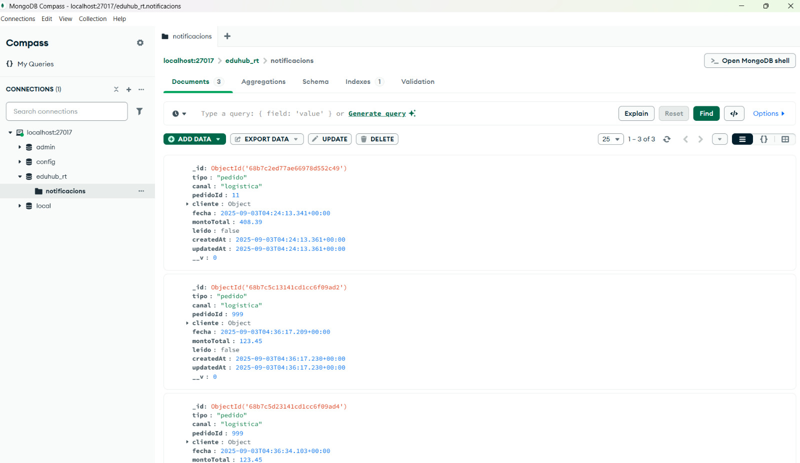
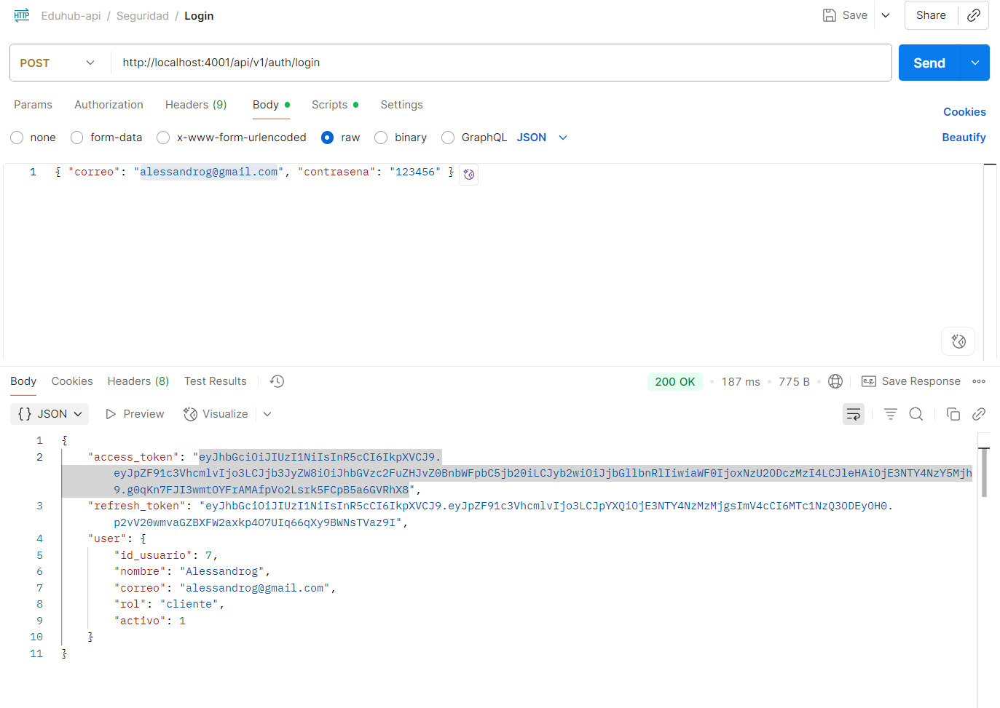
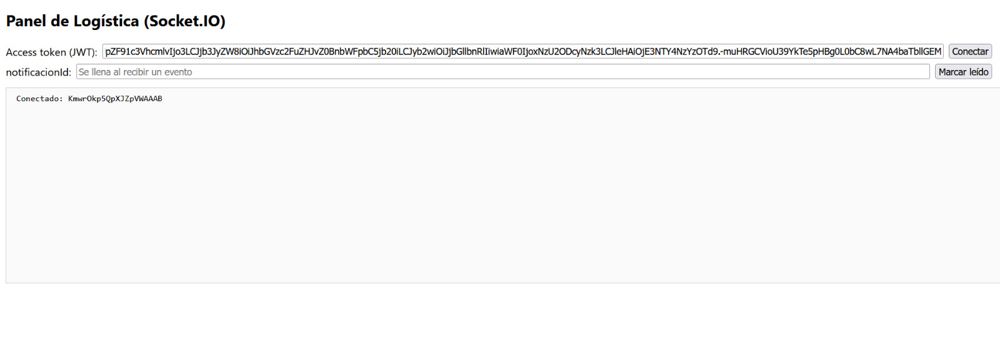
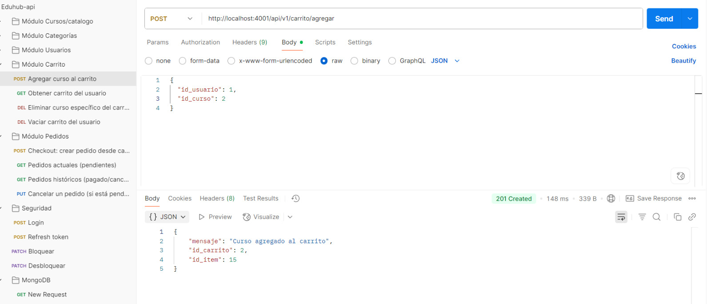
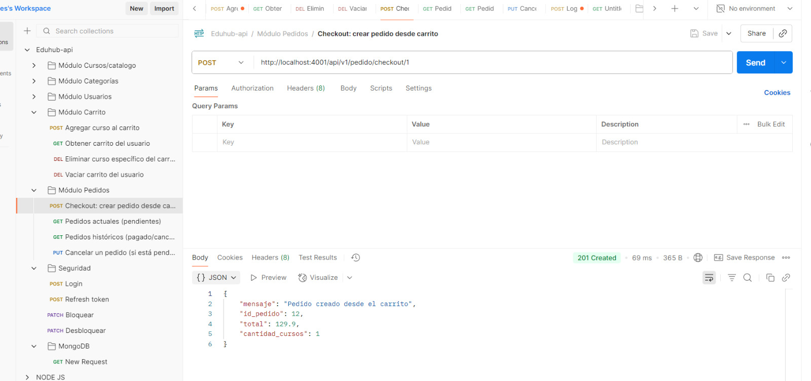
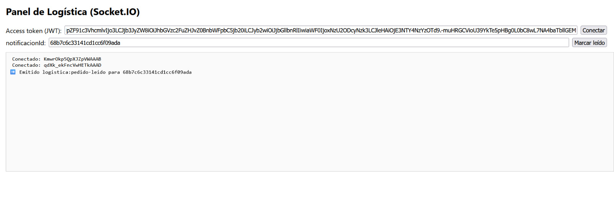
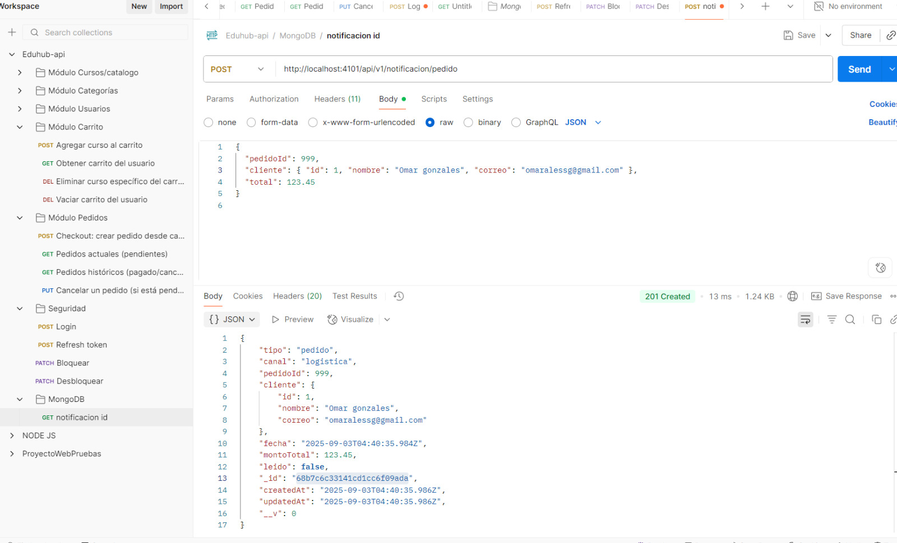
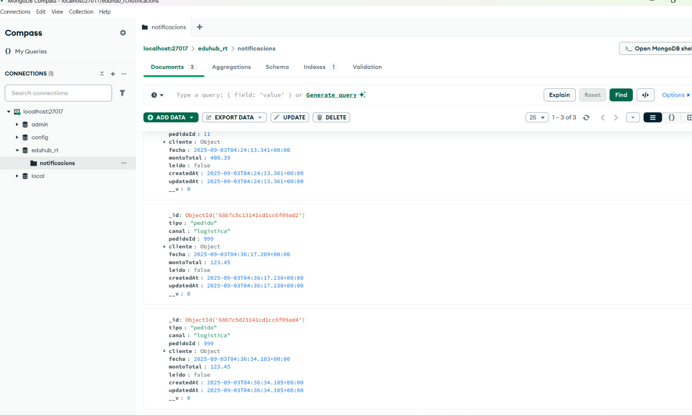

# Proyecto: Eduhub
Eduhub es una empresa tecnológica peruana que ofrece una plataforma web para la venta de cursos virtuales en áreas como programación, diseño gráfico, negocios, idiomas, marketing digital, entre otros. Su modelo permite que instructores independientes publiquen contenido educativo en video, mientras que los estudiantes compran acceso ilimitado a los cursos desde cualquier dispositivo. El negocio está orientado a la educación continua y al autoaprendizaje.

## Integrantes
- Gonzales Dávila, Omar Alessandro 
- Paredes Asurza, Diomedes Víctor Alejandro 
- Zea Granados, Crhistian Paul

## Esquema de base de datos
El modelo de base de datos de Eduhub para el apartado de notificaciones está diseñado con un enfoque NoSQL.

## Flujo de eventos y prueba de funcionamiento
1. Se ejecuta el backend y un usuario inicia sesión.

2. Se copia el access token generado en el panel de logistica para recibir las notificaciones.

3. El usuario realiza un pedido.

4. Se verifica que el pedido ha sido realizado y se marca como leído.

